<!-- ===== About me ===== -->
<h2 align="center">👋 Hey! I'm Mykyta Vasylets</h2>

  💻 self-taught developer • ⚡ exploring Python, JS, HTML, SASS/CSS • 🚀 building pet-projects and learning every day

---

<!-- ===== Dark-Fantasy: Animated Portal ===== -->

  

<!-- ===== Tech stack icons ===== -->

  

---

<!-- ===== Most Used Languages ===== -->

  

<!-- ===== Streak stats ===== -->

  

<!-- ===== Activity Graph ===== -->

  

---
